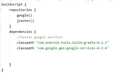
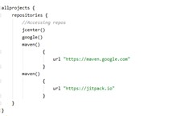

# Music and Chill
## Adam Eagle, Cayla Wright Brandon Ferguson

## Table of Contents
1. [Overview](#Overview)
1. [Description](#Description)
1. [Product Specs](#Schema)
1. [Wireframes ](#Wireframes)
1. [Schema](#Schema)
1. [Models](#Schema)
1. [Network Request](#Schema)
1. [Libraries/Dependencies](#Schema)
1. [Images](#Images)
1. [Demo](#Demo)

## Overview
Music and chill is  for people who simply enjoy music. This Application allows you and your friends to enjoy music together. A Virtual hang out just like a Music release Party of various genres of music.

## Description 

## Product Specs

## Wireframes 

## Shema 

## Models 

## Network Request 
 
 

## Libraries/Dependencies 
 

## Images
 
 

## Demo!

