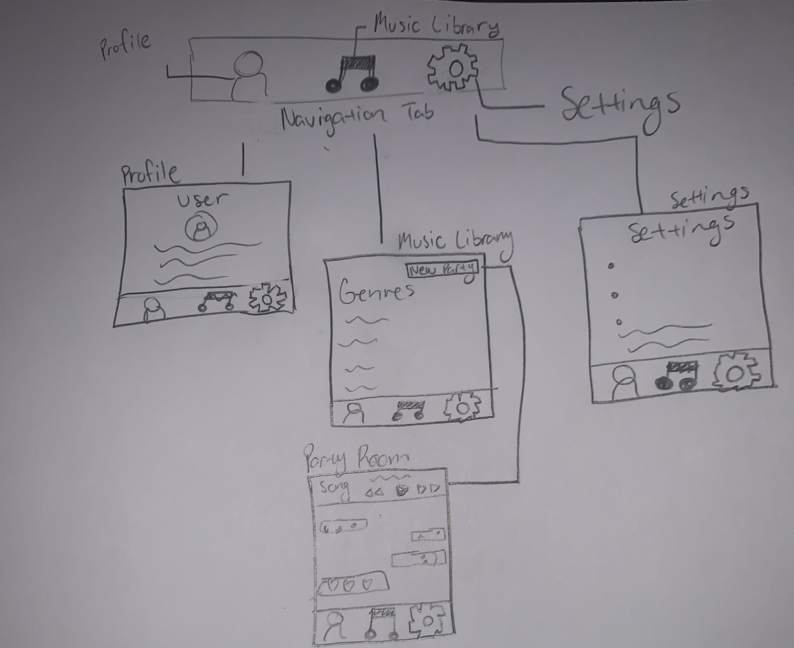
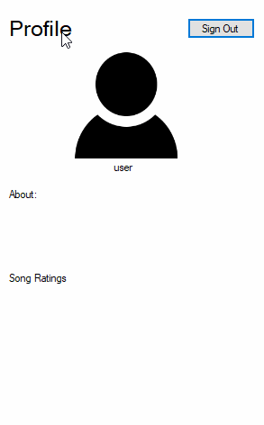
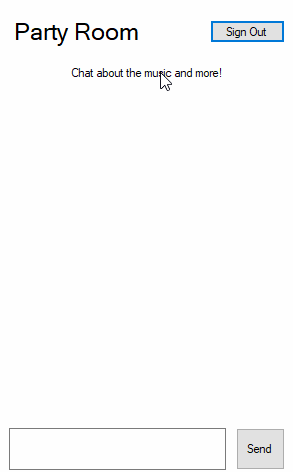
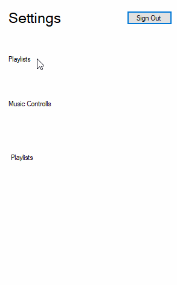

# Music and Chill

## Table of Contents
1. [Overview](#Overview)
1. [Product Specs](#Product-Specs)
1. [Wireframes](#Wireframes)
1. [Schema](#Schema)

## Overview 

### Description
Users can host listening parties with friends and family to connect with music. 

## Product Specs
1. User Stories (Required and Optional)
Required 
* User can login and view profile 
* View genres and popular songs 
* User can add friends to parties 
* Chat among users in party 
* Settings Tab 

Optional 
* Rate songs 
* Display song analytics 

2. Screen Archetypes
* Login- log into account 
* Register- register account 
* Party Room- chat and listen to music with friends 
* User Profile- upload profile picture and fill out information 
* Music Library- Select song for party 
* Settings- Set user preferences

3. Navigation
**Tab Navigation**
* Profile 
* Settings 
* Music Library 

**Flow Navigation**
* Login --> takes you to profile screen 
* Music Lubrary --> view songs and create room 
* Party Room --> chat and select songs 
* Settings --> user settings 

## Wireframes 
 

## Schema 
### 1. Models 

#### Post

   | Property      | Type     | Description |
   | ------------- | -------- | ------------|
   | objectId      | String   | unique id for user chat post |
   | author        | Pointer to User| display profile photo |
   | image        | File| display song cover |
   | image         | File     | image that user posts |
   | song         | File     | song playing in chat |
   | likesCount    | Number   | number of likes songs receives 

   
   
### 2. Network Requests 
#### List of network requests by screen

   ### Profile Screen
   - (Read/GET) Query logged in user object
   - (Update/PUT) Update user profile image
      
   ### Music Library Screen 
   - (Read/GET) Query songs 
   
   ### Setting Screen 
   - (Update/PUT) Update user settings 
   
   ### Party Room 
   - (Create/POST) Create a new post in chat 
   - (Read/GET) Query songs to play 

### Completed user stories
- [X] Login screen created 
- [X] Chatroom screen created 
- [X] Profile screen created 
- [X] Setting screen created
- [X] Music Library Screen Created
- [X] Setting screen created
- [X] Started designing UI
- [X] Configure Music Player
- [X] Connected Backend and UI
- [X] Backend chat connectors created
- [X] Configure firebase networks and connections for chatting capabilities #12
- [X] Upload App Images 
- [X] Merge all projects to main branch
- [X] Configure Login API

### App Gifs

### App Images 
- App Icons 

- App Logo 

