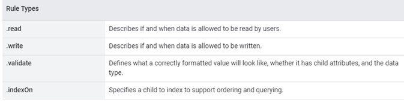
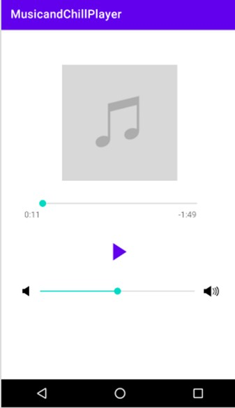

# Music and Chill
## Adam Eagle, Cayla Wright Brandon Ferguson

## Table of Contents
1. [Overview](#Overview)
1. [Description](#Description)
1. [Product Specs](#Schema)
1. [Wireframes ](#Wireframes)
1. [Models](#Schema)
1. [Network Request](#Schema)
1. [Libraries/Dependencies](#Schema)
1. [Images](#Images)
1. [Demo](#Demo)

## Overview
Music and chill is  for people who simply enjoy music. This Application allows you and your friends to enjoy music together. A Virtual hang out just like a Music release Party of various genres of music.

## Description 
We created Music and chill for people who enjoy music and online music streaming services. With our application users will be able to upload and listen to their own songs and listen to music updated through our networks. This will give the users the ability to stream their own music and various genres from our APIs. 

## Product Specs
- Media Player 
- Saved Songs 
- Home 
- Browse Songs

## Wireframes 
 

### Models 

   | Property      | Type     | Description |
   | ------------- | -------- | ------------|
   | editTextTitle      | String   | Edit song title |
   | author        | Pointer to User| record user actions |
   | textViewImage        | File| dcollect song data |
   | progressBar         | File     | Display counter |
   | audioUri         | File     | song playing in chat |
   | referenceSongs    | Number   | connecting songs to API 

## Network Request 
For our Network Request we used Firebase for our API needs. We stored our database and managed our storage with their networks. We used Firebase Realtime Database Security Rules to determine who has read and write access to our database, how we structured the data, and what indexes exist.

 

## Libraries/Dependencies 
 
 
 
 

## Images
 
 

## Demo!
 
 
